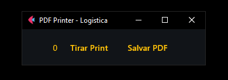
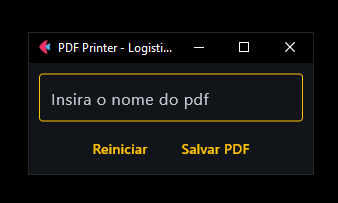

# Pdf_Printer

Este é um aplicativo simples que captura prints da tela e os salva em um arquivo PDF. Ele é útil para gerar relatórios visuais, documentações ou armazenar imagens de forma organizada em um único arquivo.




## Funcionalidades

- Captura múltiplos prints da tela.
- Salva os prints em um arquivo PDF.
- Interface fácil de usar para quem precisa gerar PDFs rapidamente a partir de capturas de tela.

## Requisitos

Antes de rodar o script, certifique-se de que tem os seguintes requisitos instalados:

- Python 3.7+
- As bibliotecas listadas no `requirements.txt`

## Aplicativo

É possivel tranforma-lo em um aplicativo com os comandos

```bash
flet pack main.py
```
### Instalar Dependências

Você pode instalar as dependências necessárias com o seguinte comando:

```bash
pip install -r requirements.txt
